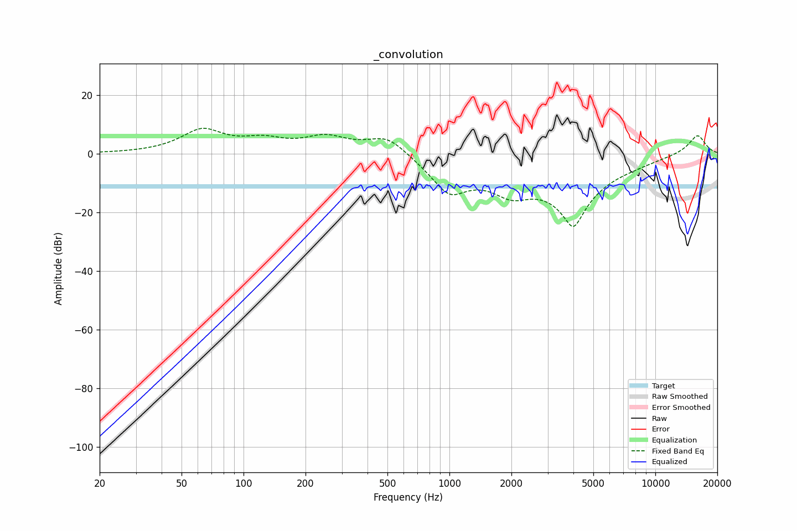

# _convolution
See [usage instructions](https://github.com/jaakkopasanen/AutoEq#usage) for more options and info.

### Fixed Band EQs
In case of using fixed band (also called graphic) equalizer, apply preamp of **-8.8dB**
(if available) and set gains manually with these parameters.

| Type    | Fc       |    Q | Gain     |
|:--------|:---------|:-----|:---------|
| Peaking | 63 Hz    | 1.41 | 7.7 dB   |
| Peaking | 125 Hz   | 1.41 | 3.7 dB   |
| Peaking | 250 Hz   | 1.41 | 5.0 dB   |
| Peaking | 500 Hz   | 1.41 | 6.8 dB   |
| Peaking | 1000 Hz  | 1.41 | -12.1 dB |
| Peaking | 2000 Hz  | 1.41 | -7.9 dB  |
| Peaking | 4000 Hz  | 1.41 | -22.9 dB |
| Peaking | 8000 Hz  | 1.41 | -0.6 dB  |
| Peaking | 16000 Hz | 1.41 | 6.7 dB   |

### Graphs
