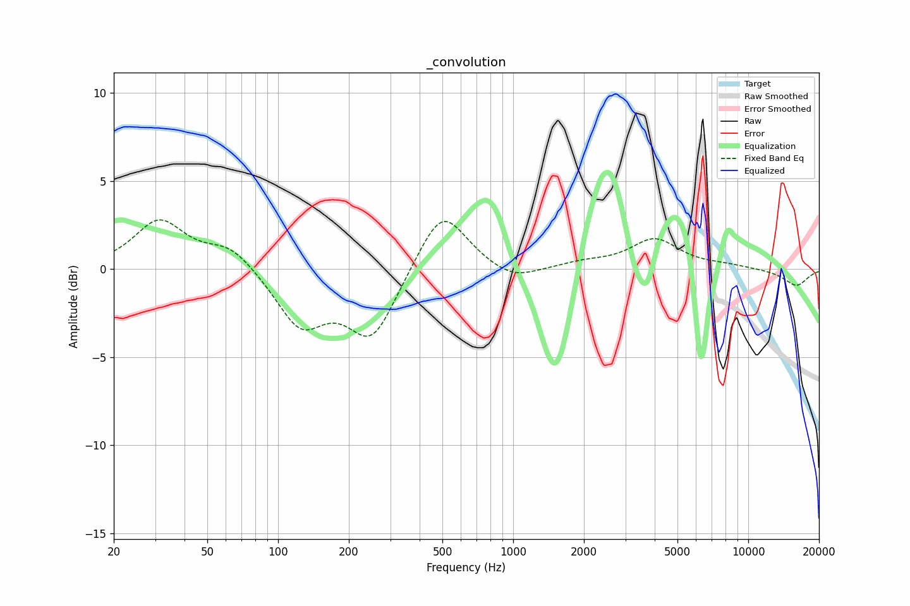

# _convolution
See [usage instructions](https://github.com/jaakkopasanen/AutoEq#usage) for more options and info.

### Fixed Band EQs
In case of using fixed band (also called graphic) equalizer, apply preamp of **-3.0dB**
(if available) and set gains manually with these parameters.

| Type    | Fc       |    Q | Gain    |
|:--------|:---------|:-----|:--------|
| Peaking | 31 Hz    | 1.41 | 2.8 dB  |
| Peaking | 62 Hz    | 1.41 | 1.3 dB  |
| Peaking | 125 Hz   | 1.41 | -3.1 dB |
| Peaking | 250 Hz   | 1.41 | -3.8 dB |
| Peaking | 500 Hz   | 1.41 | 3.5 dB  |
| Peaking | 1000 Hz  | 1.41 | -0.8 dB |
| Peaking | 2000 Hz  | 1.41 | 0.3 dB  |
| Peaking | 4000 Hz  | 1.41 | 1.7 dB  |
| Peaking | 8000 Hz  | 1.41 | 0.3 dB  |
| Peaking | 16000 Hz | 1.41 | -1.0 dB |

### Graphs
