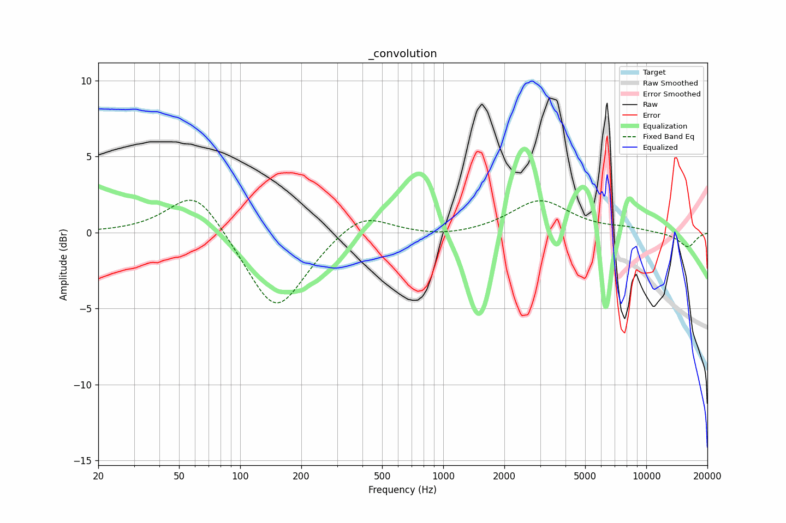

# _convolution
See [usage instructions](https://github.com/jaakkopasanen/AutoEq#usage) for more options and info.

### Fixed Band EQs
In case of using fixed band (also called graphic) equalizer, apply preamp of **-2.2dB**
(if available) and set gains manually with these parameters.

| Type    | Fc       |    Q | Gain    |
|:--------|:---------|:-----|:--------|
| Peaking | 60 Hz    | 1.12 | 2.9 dB  |
| Peaking | 150 Hz   | 1.04 | -5.2 dB |
| Peaking | 400 Hz   | 1.12 | 1.5 dB  |
| Peaking | 1000 Hz  | 0.92 | -0.3 dB |
| Peaking | 3000 Hz  | 1.04 | 2.0 dB  |
| Peaking | 8000 Hz  | 1.41 | 0.2 dB  |
| Peaking | 16000 Hz | 1.41 | -1.0 dB |

### Graphs
